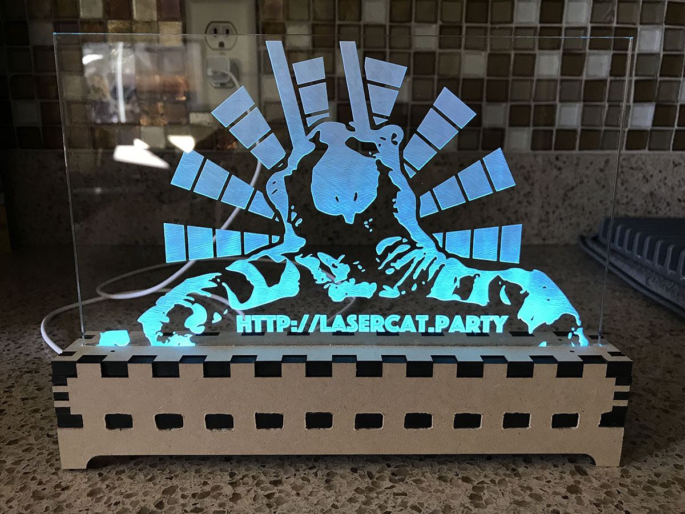
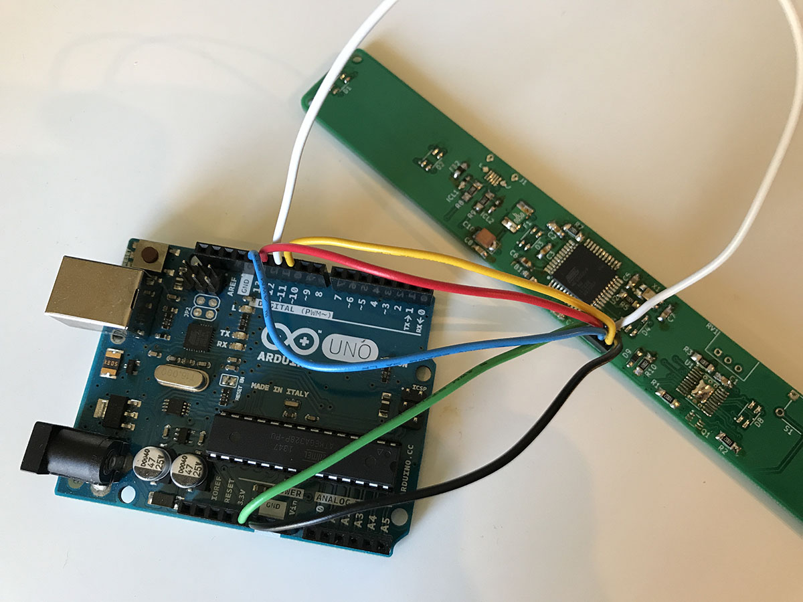
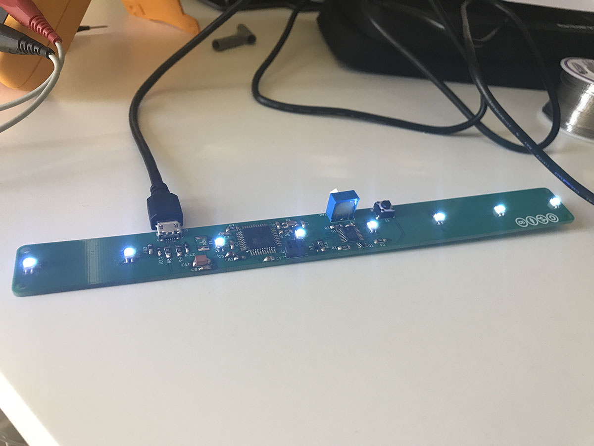

# Edge-lit Display
This repository contains everything you need to build an edge-lit display using
RGB LEDs and laser etched acrylic with a laser cut enclosure.

## System Overview
The display is controlled by an [ATmega32U4], the same microcontroller used in
several [Arduino] boards. It is flashed as an [Arduino Leonardo] over the ICSP
header to make it easier to work with, using an actual [Arduino] as the
programmer. The design surrounding the [ATmega32U4] support circuitry, including
the USB connections, is based on the [Arduino Leonardo] schematics.

The microcontroller communicates with a [TLC5971] over SPI to drive the eight
RGB LEDs. The [TLC5971] is a 12-channel, constant-current sink, 16-bit PWM LED
driver (ie, capable of driving four RGB LEDs at a time). Therefore, the eight
RGB LEDs are divided into two groups and time-multiplexed by the
microcontroller using two high-side PMOS transistors. This allows us to address
each channel of each LED individually.

This circuit is then fitted into a laser cut enclosure with the LEDs directed
into the edge of a laser etched acrylic display. The code on the
microcontroller cycles the colors of the LEDs by rotating through all possible
values for "hue" in the HCY (hue-chroma-luma) colorspace, and converting to 16-
bit RGB for transmission to the [TLC5971].

The whole thing is powered using a standard USB 2.0 cable and includes a
potentiometer to control the brightness of the LEDs by varying the current-
setting resistance of the [TLC5971].

## Schematics
Schematics were designed in [KiCad] v4. This repository has a dependency on my
own [part library] and assumes that my [part library] is located in the same
path as this repository (ie, the `edge-lit display` and `bmatcuk-kicad-library`
directories live in the same directory).

This first schematic is the [ATmega32U4], USB, and support circuitry:

The next schematic connects the microcontroller to the LEDs, driver, and high-
side PMOS to time-multiplex the LED groups:

## PCB Layout
The PCB was designed in [KiCad] v4. This repository has a dependency on my
own [part library] and assumes that my [part library] is located in the same
path as this repository (ie, the `edge-lit display` and `bmatcuk-kicad-library`
directories live in the same directory).

The circuit is laid out as a two-layer design. The front layer contains all of
the components and a ground plane with the back layer as a signal layer. This
is probably the weakest part of the whole project as this is the first time
I've laid out a circuit with so many surface mount components in a constrained
space.

## Enclosure
The enclosure was designed in [FreeCAD] 0.17 assuming it would be made out of
MDF wood with a thickness of 0.251in and laser kerf of 0.011in. The screen
was designed for acrylic with a thickness of 3mm and a laser kerf of 0.2mm.
These values can be easily modified in [FreeCAD] by editing the spreadsheet
called "Datum"; the rest of the design will update automatically.

Once the design was complete, 2D projections were made of each piece and these
projections were exported as "flattened svgs". The resulting svg was edited in
[Inkscape] to conform to the format that the manufacturer wanted (ie, to make
the cuts blue, for example).

The svg below might be really difficult to see on your screen because the
stroke width is only 0.01mm. This was a requirement from where I had the
parts laser cut.

## Acrylic Screen
The outline of the screen was designed in [FreeCAD] with the enclosure. Once
the 2D projection was exported as an svg (as mentioned above), it was imported
into [Inkscape] to create the design. Originally, I was going to do some sort
of cityscape, but then I thought it would be more fun to tie this back to a
previous passion project of mine: [lasercat.party] (github: [lasercatparty])!

I edited the photo of the cat in [Photoshop] to remove the background, convert
to greyscale, and then darken some of the light areas with the burn tool, and
lighten some of the dark areas with the dodge tool. The image was then imported
into [Inkscape] and I used the "Trace Bitmap" function to vectorize it. This
was an iterative process: adjusting light and dark areas in [Photoshop], re-
importing in [Inkscape] to vectorize, etc, until I was happy with the result.
The rest of the design was done entirely in [Inkscape]. Then everything was
grouped together and flipped horizontally so that it could be etched on the
back of the acrylic.

The [Photoshop] file is also included in this repository (cat.psd).

Like above, it may be difficult to make out the edge cuts on your screen
because the stroke width is 0.01mm.

## Manufacturing
The first step was getting the PCB, enclosure, and screen manufactured. I sent
the gerbers to [ALLPCB.com] for PCB manufacturing. I'm very impressed with them
and would definitely recommend. I had the boards in my hands in less than a week
and their prices are very reasonable! The enclosure and screen svgs were sent to
[Ponoko] for laser cutting and etching. Therefore, the MDF and acrylic
thicknesses and kerfs match their specs, and the files are formatted to their
liking (blue for cuts, black for area engraving, red for line engraving; stroke
width of 0.01mm). All electrical components were ordered from [DigiKey]. This
repository includes a Bill Of Material file called `edge-lit display.csv` which
includes all of the [DigiKey] part numbers. You can upload the file to their
website to add all of the parts to your cart.

## Build Log
### Soldering
With PCB and components in hand, the next step is soldering the PCB. We want to
load the [Arduino] bootloader onto our [ATmega32U4], so the first thing we'll
solder is the microcontroller and support circuitry. Installing the [Arduino]
bootloader is done via the ICSP header which uses the SPI pins on the
microcontroller; these pins are also used to control the [TLC5971], so we're
going to leave that and most of the circuitry around it off our board for now.

*Technically*, I think it would be ok to solder everything before installing
the bootloader because it's unlikely that any of the data will make sense to
the [TLC5971] and the microcontroller will tri-state all of the IO pins while
flashing so all of the LEDs will be off anyway, but why risk it? Besides,
pausing to flash the microcontroller mid-solder gives us an opportunity to
make sure everything is working up to that point; troubleshooting will be
easier with fewer components on the board.

That said, I soldered all of the passives (resistors, capacitors, and the
ferrite beads), the varistors, fuse, ICSP header, diode, and [ATmega32U4]. I
technically didn't need to solder all of the passive components, since some of
them are support circuitry for the [TLC5971], but it was easier to solder them
all together. I then tested for any bridged pins with a multimeter, and, when I
was satisfied everything looked good, I moved on to installing the bootloader.

Some tips for soldering: I did most of the soldering with a soldering iron
(my trusty [Hakko FX-888D]) with a beveled tip (the [T18-CF15]). It's possible
to solder everything this way with the liberal application of flux (I have a
[Kester 186 Flux Pen]) - search for "drag soldering" tutorials. I found it
was easier to solder first using this method, and then touch things up a bit
with a hot air rework station (I'm using an [Aoyue Int866]). For example, I
soldered the [ATmega32U4] a little off-center; very hard to fix with an iron,
but short work for the hot air station.

### The Bootloader
To install the bootloader, I flashed an [Arduino Uno] with the ArduinoISP. To
do this in the [Arduino] IDE, select the Uno as the device and open the
ArduinoISP example sketch. Make sure all of the `#define`s are right at the
top of the file and then upload the sketch to the Uno. Next, disconnect the
Uno from your computer and make the following connections:
* 5V on the Uno to pin 2 of the ICSP
* GND on the Uno to pin 6 on the ICSP
* D10 on the Uno (reset signal) to pin 5 on the ICSP
* D11 on the Uno (MOSI) to pin 4 on the ICSP
* D12 on the Uno (MISO) to pin 1 on the ICSP
* D13 on the Uno (SCK) to pin 3 on the ICSP

Other [Arduino]s can be used in place of the [Arduino Uno] using a similar
process. You just need to figure out what pins are used for SPI (MOSI, MISO,
and SCK) and the reset pin. You can actually change the pins in the `#define`s
at the top of the ArduinoISP sketch.

Anyway, once the wired connections are made, reconnect the [Arduino Uno] to
your computer. Select the [Arduino Leonardo] from the device menu, set the port
to where the Uno is connected, change "programmer" to "Arduino as ISP", and
select "Burn Bootloader". This process will take a couple minutes, but it will
test to make sure installation was successful, so if you don't see any errors,
you know your soldering, at least up to this point, is good.

### Soldering Part Deux
After the bootloader is installed, disconnect the [Arduino Uno] and solder
the rest of the components. Now the sketch can be flashed via USB! Connect the
PCB to your computer via USB. If all your soldering went well, you should be
able to flash the code to it by selecting the [Arduino Leonardo] device from the
[Arduino] IDE and uploading. You should hopefully see the LEDs cycle through
all of the colors of the rainbow!

### Constructing the Enclosure
Putting the case together is fairly straightforward, but you may find that the
slots are fairly tight. The company I ordered my lasercut parts from ([Ponoko])
didn't have very accurate measurements for wood thickness or kerf. I found the
wood they sent me was around 1.5mm thicker then I was expecting. I had to use a
wood file to make the pieces fit together, and, even then, they were so snug I
didn't bother using any glue.

Basically, you want to put the bottom and sides together, gluing if necessary.
I put the lasercut side (with the burn marks) on the inside to hide it. Then
fit the PCB in. I had planned on using some M2 nylon stand-offs to mount the
PCB (hence the little holes in the top and bottom pieces), but the holes ended
up being too small to thread the stand-offs through. So, instead, I just
hammered some nails through the bottom to keep the PCB from sliding around.

Next, slide the acrylic display through the top piece and put the top of the
enclosure on. The slots on the side pieces should keep the acrylic from falling
over, and should line it up to be right on top of the LEDs. If you are
sucessfully using stand-offs, you can have some stand-offs go to the top of the
enclosure, too.

I adjusted some of the calculations in the [FreeCAD] model after I received my
lasercut enclosure to hopefully make it less snug. I also regenerated the
enclosure.svg file, but I haven't tried getting another enclosure made up.

## License
Software in this repository is licensed under the [MIT] license. Hardware
schematics are released under a Creative Commons Attribution and Share Alike
license ([CC-BY-SA] 4.0). PCB layout designs, enclosure designs, and acrylic
display designs are licensed under a Creative Commons Attribution, Non-
Commercial, Share Alike license ([CC-BY-NC-SA] 4.0).

[ALLPCB.com]: http://www.allpcb.com/
[ATmega32U4]: http://www.microchip.com/wwwproducts/en/ATmega32u4
[Aoyue Int866]: https://www.aoyue.eu/aoyue-int866-3in1-rework-station-lead-free-hot-air-soldering-station.html
[Arduino Leonardo]: https://store.arduino.cc/usa/arduino-leonardo-with-headers
[Arduino Uno]: https://store.arduino.cc/usa/arduino-uno-rev3
[Arduino]: https://www.arduino.cc/
[CC-BY-NC-SA]: https://creativecommons.org/licenses/by-nc-sa/4.0/
[CC-BY-SA]: https://creativecommons.org/licenses/by-sa/4.0/
[DigiKey]: https://www.digikey.com/
[FreeCAD]: https://www.freecadweb.org/
[Hakko FX-888D]: https://www.hakkousa.com/products/soldering/hakko-fx-888d-digital-soldering-station-10145.html
[Inkscape]: https://inkscape.org/
[Kester 186 Flux Pen]: https://www.kester.com/products/product/186-flux-pen
[KiCad]: http://kicad-pcb.org/
[MIT]: https://choosealicense.com/licenses/mit/
[Photoshop]: https://www.adobe.com/products/photoshop.html
[Ponoko]: https://www.ponoko.com/
[T18-CF15]: https://www.hakkousa.com/products/soldering-iron-tips/t18-series/t18-cf15.html
[TLC5971]: http://www.ti.com/product/TLC5971
[lasercat.party]: http://lasercat.party
[lasercatparty]: https://github.com/bmatcuk/lasercatparty
[part library]: https://github.com/bmatcuk/bmatcuk-kicad-library/
